# ***EMO - YEDEK PARÇA SATIŞ VE MUHASEBE OTOMASYONU***

    

  

<b>-> Ekip çalışmasıyla yaptığımız yedek parça satış ve muhasebe otomasyonu.Bu otomasyondan firmalar ürünlerini ekleyip muhasebesini yapabilir,kampanyalar oluşturabilir. Müşteriler ise ürün satın alımı yapabilir, kampanyalardan yararlanabilir ve ürün iade işlemlerini kullanabilir!</b>
  

<b>-> SATICI FİRMA ÖZELLİKLERİ</b>

<li>Ürün ekleme</li>
<li>Ürün silme</li>
<li>Ürün güncelleme</li>
<li>Ürün stok kontrol</li>
<li>Kampanya ekleme</li>
<li>Kampanya listeleme</li>
<li>Kampanya düzenleme</li>
<li>İade yanıtlama</li>
<li>İade bitirme</li>
<li>Kargo ve teslim bilgisi kontrol ve düzenleme</li>
<li>Müşteriye geri bildirim oluşturma</li>
<li>Ürün deposu ekleme/düzenleme</li>
<li>Ürün depo ve iletişim güncelleme/düzenleme</li>
<li>Admin ve müşteri listeleme</li>
<li>Ödeme işlemleri görüntüleme</li>
<li>Kullanıcılara admin özellikleri atama</li>
<li>Profil ayarları</li>
<li>Ve benzeri özellikler...</li>

  

<b>-> MÜŞTERİ ÖZELLİKLERİ</b>

<li>Ürün sepet işlemleri</li>
<li>Ürün satın alma işlemleri</li>
<li>Ürün Görseline erişme</li>
<li>Kampanyaları kullanma</li>
<li>Kampanya listeleme</li>
<li>Depo iletişim bilgilerine erişme</li>
<li>İade başlatma</li>
<li>Satıcıya geribildirim yollama</li>
<li>Bakiye ekleme işlemleri</li>
<li>Geçmiş ödeme/bakiye/iade işlemleri görüntüleme</li>
<li>Profil ayarları</li>
<li>Ve benzeri özellikler...</li>

   
-> Satıcı firma hem bu uygulama ile ürünlerinin stok fiyat vs bilgilerinin muhasebesini gerçekleştirebilir, hemde ürünlerini otomasyon üzerinden E-TİCARET mantığıyla satabilir. 
-> Müşteri ihtiyacı olan parçanın stok/depo/fiyat bilgilerine erişip iştediğinde satıcı firmadan satın alabilir 
   

 
 

    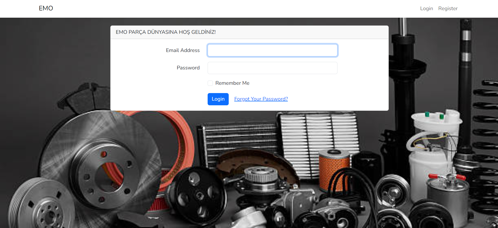  

    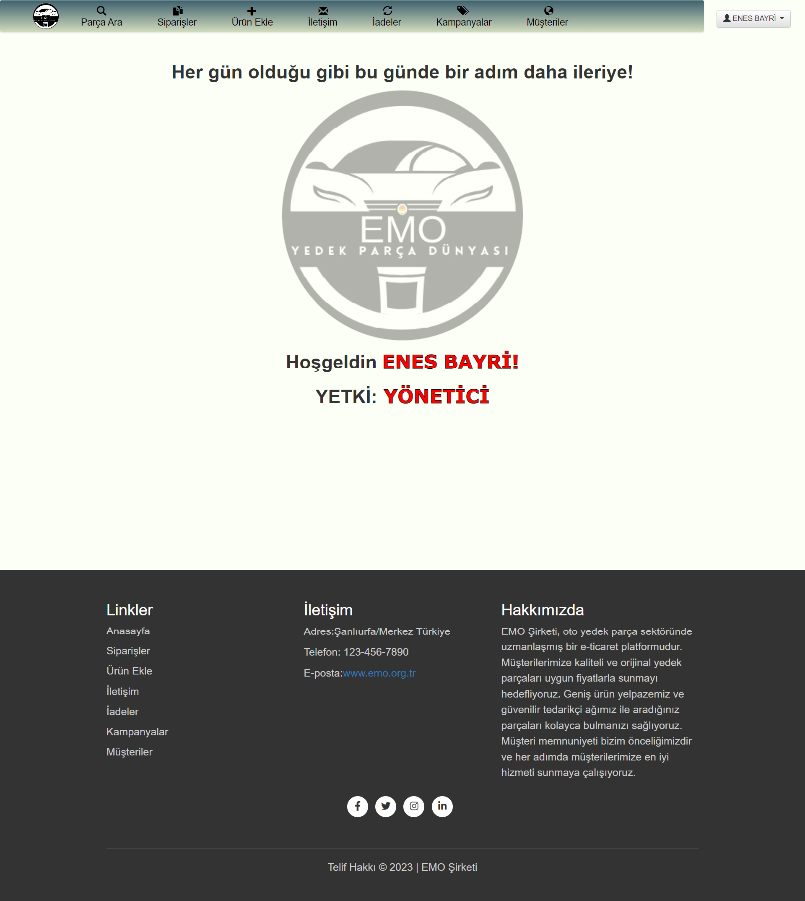  

    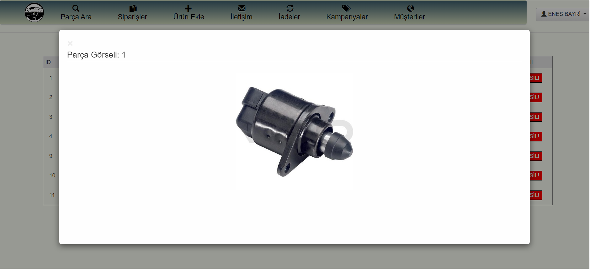  

    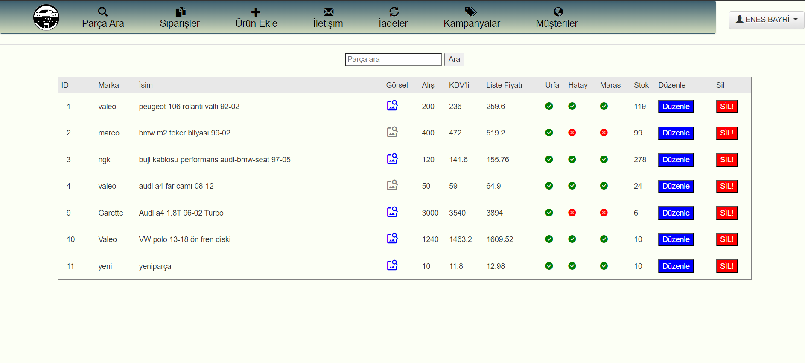  

    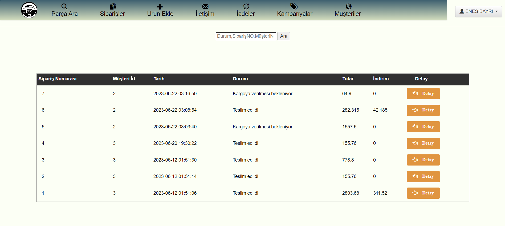  

    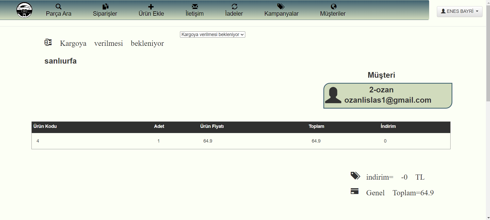  

    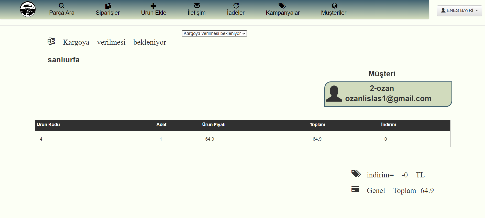  

    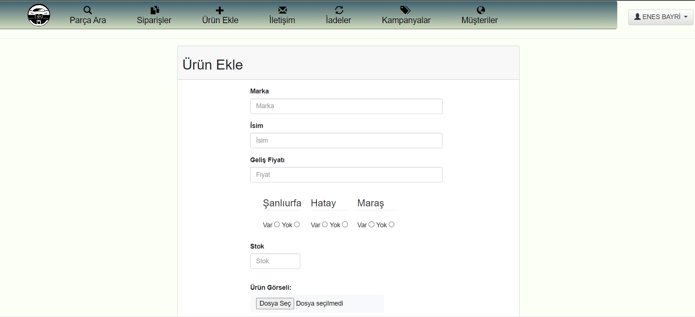  

    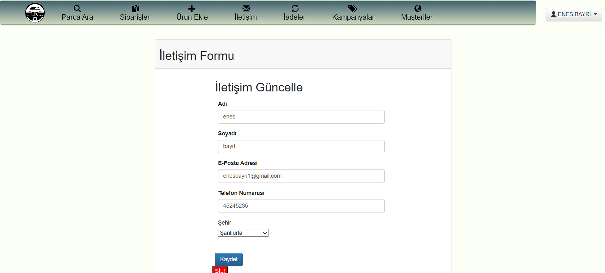  

    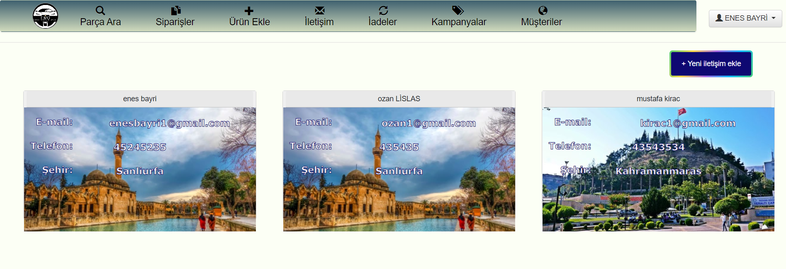  

    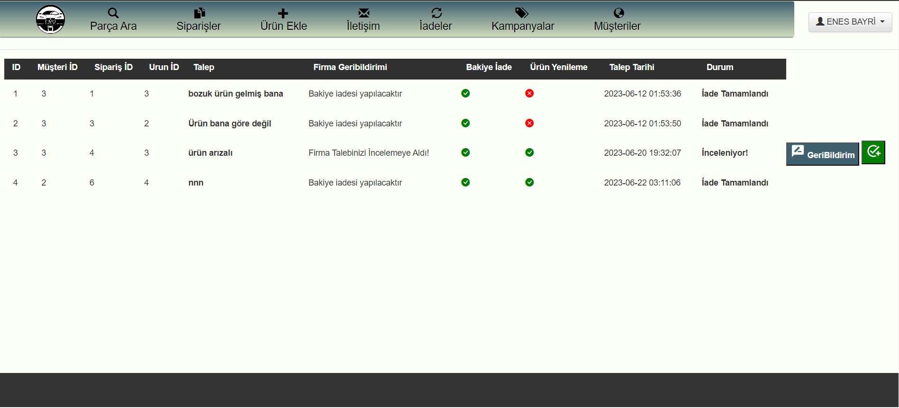  

    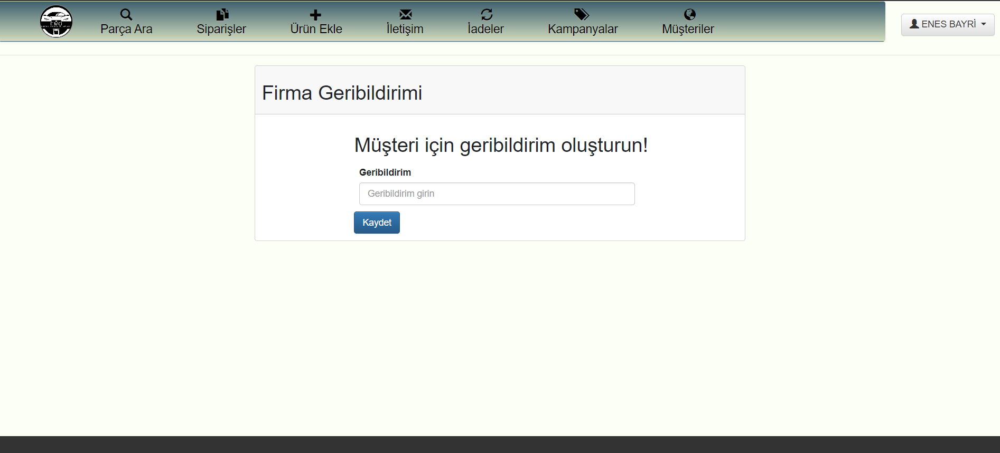  

    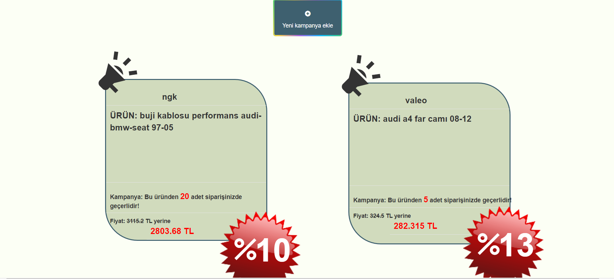  

    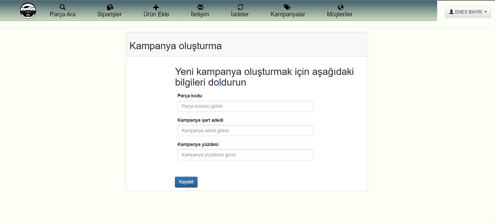  

    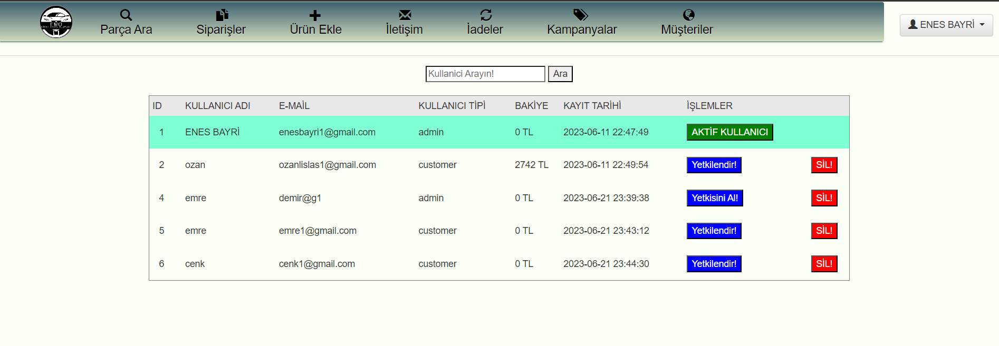  

    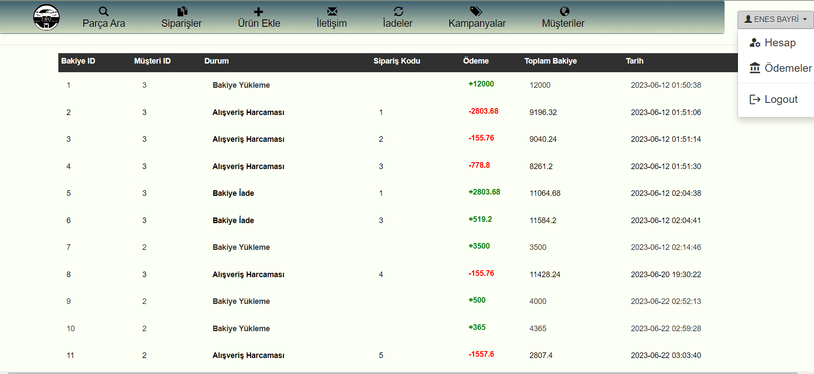  

    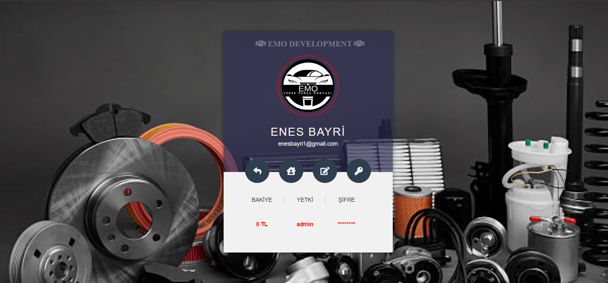  

    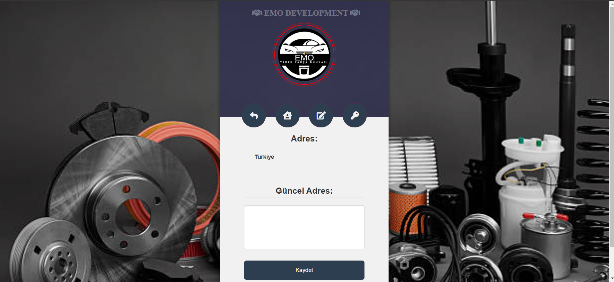  

    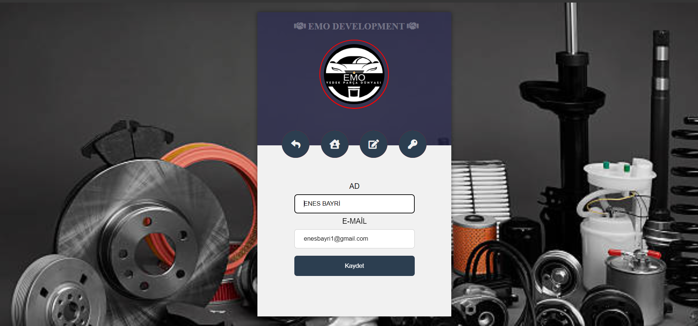  

    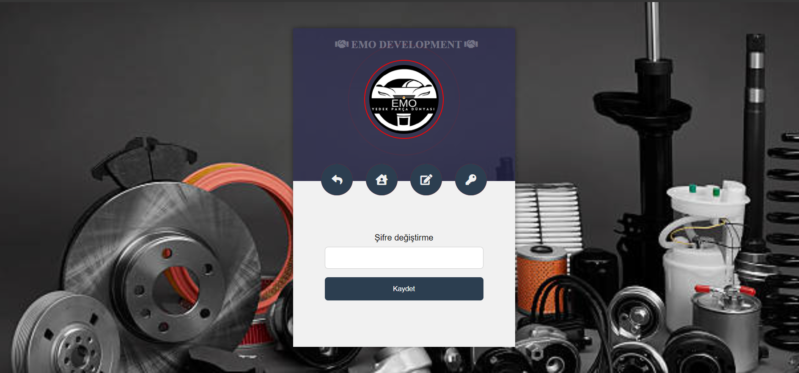  

